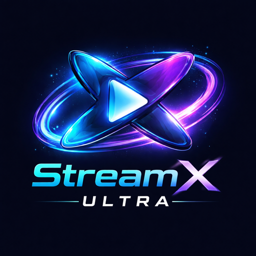

  

  <h1 align="center">StreamX Ultra</h1>
  

    <strong>Next-Generation Live TV & Streaming Platform</strong> 
    Built with ❤️ by <a href="https://github.com/cybernahid-dev"><strong>AeonCoreX</strong></a>
  

  

    
    
    
    

  

  

   

  

    <h3>📥 Official Download</h3>
    
    

      
    

  

 

  
<strong>📖 Table of Contents</strong>

  
  * [About the Project](#-about-the-project)
  * [Key Features](#-key-features)
  * [Architecture](#-architecture)
  * [Tech Stack](#-tech-stack)
  * [Getting Started](#-getting-started)
  * [Roadmap](#-roadmap)
  * [Contributing](#-contributing)
  * [License](#-license)

---

## 🧭 About the Project

**StreamX Ultra** is an enterprise-grade streaming engine designed for the modern Android ecosystem. By integrating **Live IPTV Protocols** and a **Spotify-Inspired Music Engine**, it provides a unified platform for all your media needs without the bloat.

Developed by **AeonCoreX**, this project focuses on **native performance**, **scalable architecture**, and a **distraction-free UI**, making it an ideal solution for modern media consumption.

### 🎯 Product Vision
To deliver a reliable, scalable, and modern live-streaming experience that feels fast, intuitive, and future-proof.

---

## 🚀 Key Features

### 🎧 Spotify-Grade Music Experience
* **Global Library Access**: Stream millions of tracks directly via JioSaavn API integration.
* **Dynamic Player UI**: Immersive, color-adaptive player interface that rivals industry leaders.
* **Background Playback**: Full support for background audio with system media control integration.
* **High-Fidelity Audio**: Optimized audio buffers for crystal clear sound quality.

### 📺 Next-Gen Live TV
* **Low-Latency Pipeline**: Minimal buffering even on 3G/Slow Wi-Fi networks.
* **Adaptive Bitrate**: Automatically switches quality based on network health (HLS/DASH support).
* **Minimalist View**: A distraction-free "Cinema Mode" for an immersive viewing experience.

---

## 🛠 Tech Stack

StreamX Ultra is built using the latest Android development standards.

| Component | Technology |
| :--- | :--- |
| **Language** |  **Kotlin** |
| **UI Framework** |  **Jetpack Compose** |
| **Architecture** | MVVM / Clean Architecture |
| **Media Engine** | Media3 / ExoPlayer |
| **Asynchronous** | Coroutines & Flow |
| **Dependency Injection** | Hilt (Recommended) |
| **Build System** | Gradle (Kotlin DSL) |
| **Min SDK** | Android 8.0 (API 26) |

---

## 🏗️ Architecture

The application follows a clean, layered architecture to ensure scalability and testability.

mermaid
graph TD;
    UI[UI Layer (Compose)] --> ViewModel;
    ViewModel --> Domain[Domain Layer / UseCases];
    Domain --> Data[Data Layer / Repository];
    Data --> Remote[Network / API];
    Data --> Local[Database / Cache];

 * UI Layer: Handles user interaction using Jetpack Compose.
 * Media Layer: Manages playback logic separately from the UI.
 * Network Layer: Handles HLS/DASH streams and API calls.
📱 Device Requirements
To ensure the best experience, we recommend:
 * OS: Android 8.0 (Oreo) or higher
 * RAM: 4GB+ (Recommended)
 * Internet: Stable 4G/5G or Wi-Fi connection
 * Audio: Headphones recommended for immersive sound

## ⚡ Getting Started
Follow these steps to build the project locally.
Prerequisites
 * Android Studio Ladybug (or newer)
 * JDK 17
 * Android SDK API 34+
Installation
 * Clone the repository
   git clone [https://github.com/cybernahid-dev/StreamX-Ultra.git](https://github.com/cybernahid-dev/StreamX-Ultra.git)

 * Open in Android Studio
   * File > Open > Select StreamX-Ultra folder.
 * Sync Gradle
   * Wait for the dependencies to download.
 * Build & Run
   * Select your emulator or physical device and click Run.

## 🗺️ Roadmap
 * [x] Core streaming foundation
 * [x] Advanced channel management
 * [ ] User Profiles: Personalized watch history
 * [ ] Global Search: Find content across channels
 * [ ] Chromecast Support: Cast to big screens
 * [ ] Play Store Release: Official public launch

## 🤝 Contributing
Contributions make the open-source community an amazing place to learn, inspire, and create. Any contributions you make to StreamX Ultra are greatly appreciated.
 * Fork the Project
 * Create your Feature Branch (git checkout -b feature/AmazingFeature)
 * Commit your Changes (git commit -m 'Add some AmazingFeature')
 * Push to the Branch (git push origin feature/AmazingFeature)
 * Open a Pull Request
 

## 📄 License
Distributed under the MIT License. See LICENSE for more information.

Built with passion by <strong>AeonCoreX</strong>

© 2026 AeonCoreX. All rights reserved.

